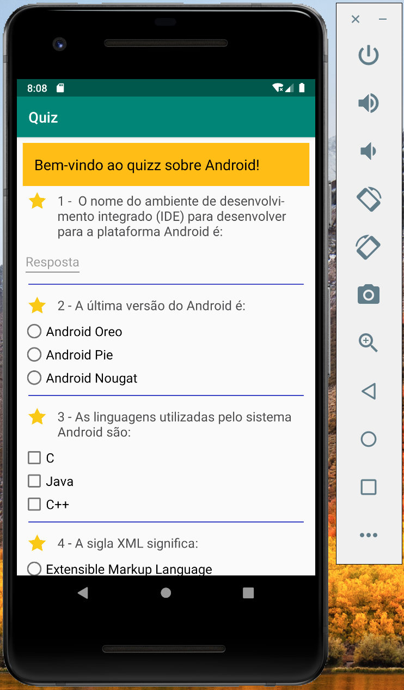
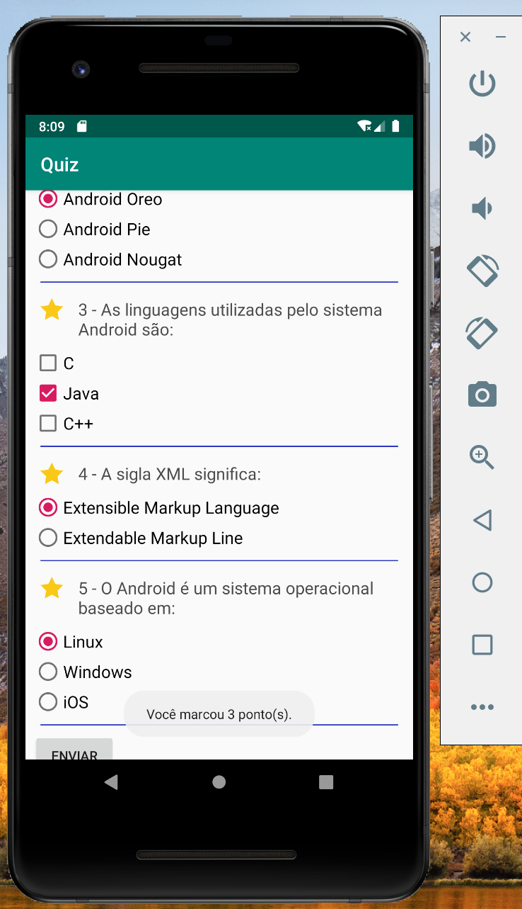

# Android quizz

O objetivo deste projeto era realizar um formulário que computasse os pontos do usuário ao final. 

Atividade desenvolvida durante o curso da Udacity - Android Basics, concluído em 05/05/2019.

  

 

  

